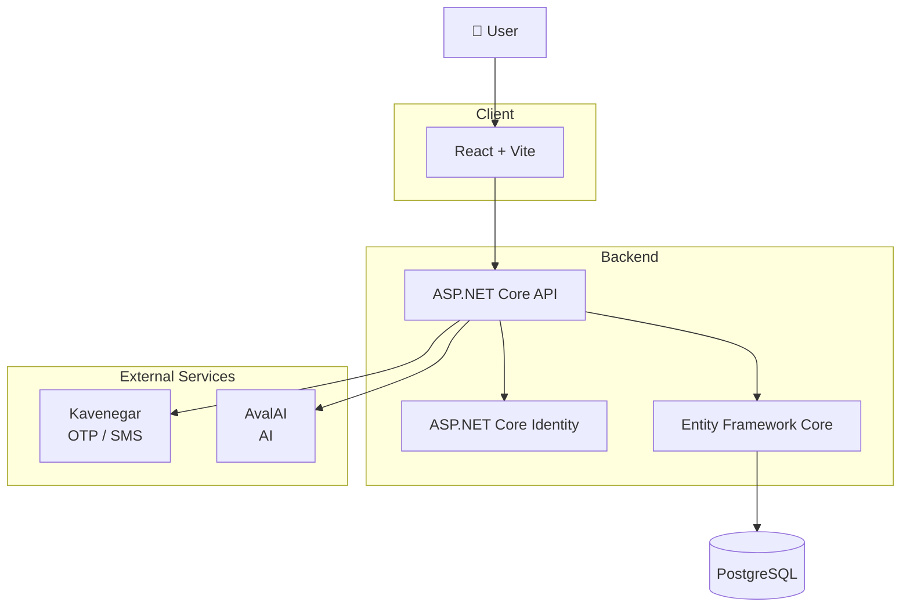
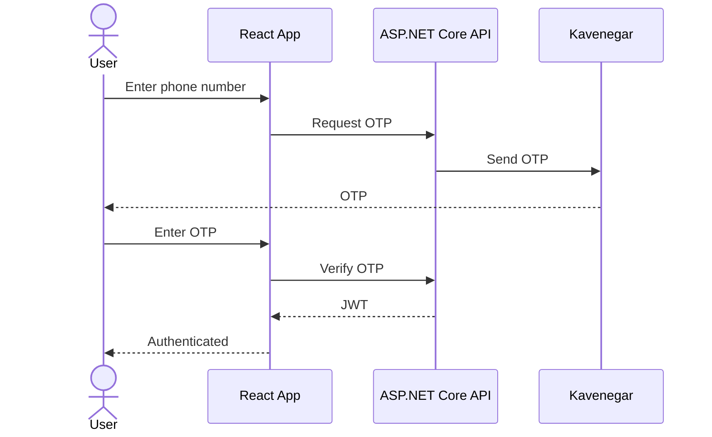
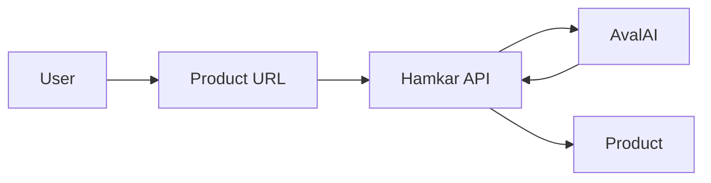
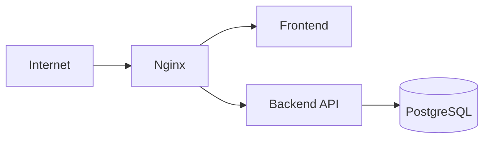

# Hamkar

> **همکار | قیمت واقعی بازار**

Hamkar is a web application for businesses to search for products, discover market offers, and manage their products.

**MVP project built with React, ASP.NET Core, PostgreSQL, and AI-powered services.**

---

## 🔗 Links

* 🌐 **Landing Page:** https://hamkar.shop
* 💻 **Source Code:** This repository

---

## ✨ Features

* 🔎 Product search
* 📦 Product management
* 💰 Offer management
* 📱 Phone number authentication with OTP
* 🤖 AI-assisted product creation from a URL
* 👥 User access management
* 🔐 JWT-based authentication

---

## 🏗️ Architecture



---

## 🧰 Tech Stack

| Layer            | Technology                  |
| ---------------- | --------------------------- |
| Frontend         | React                       |
| Build Tool       | Vite                        |
| UI               | Ant Design                  |
| Routing          | React Router                |
| Backend          | ASP.NET Core                |
| ORM              | Entity Framework Core       |
| Authentication   | ASP.NET Core Identity + JWT |
| Database         | PostgreSQL                  |
| Reverse Proxy    | Nginx                       |
| Containerization | Docker + Docker Compose     |
| SMS              | Kavenegar                   |
| AI               | AvalAI                      |

---

## 🔐 Authentication

Hamkar uses **phone-number authentication with OTP**.



---

## 🤖 AI-powered Product Creation

Hamkar can create product information from a product URL.

The application sends the required information to the AI service and uses the generated result to populate product data.



---

## 📂 Project Structure

```text
.
├── frontend/              # React application
├── backend/               # ASP.NET Core API
├── landing/               # Landing page
├── docker-compose.yml
├── .env.example
└── README.md
```

---

## 🚀 Getting Started

### Prerequisites

* Docker
* Docker Compose

### 1. Clone the repository

```bash
git clone <repository-url>
cd hamkar
```

### 2. Configure environment variables

Create a `.env` file based on `.env.example`.

```env
POSTGRES_PASSWORD=your-password
```

Configure the required credentials for external services such as:

* Kavenegar
* AvalAI
* Database
* Authentication

> **Never commit secrets or `.env` files to the repository.**

### 3. Start the application

```bash
docker compose up -d
```

To view the application logs:

```bash
docker compose logs -f
```

To stop the application:

```bash
docker compose down
```

---

## 🔌 External Services

### Kavenegar

Used for sending OTP messages during phone-number authentication.

[Kavenegar](https://kavenegar.com?utm_source=chatgpt.com)

### AvalAI

Used for AI-powered product information extraction.

[AvalAI](https://avalai.ir?utm_source=chatgpt.com)

---

## 🌐 Deployment

The application is containerized using Docker Compose.



---

## 📌 Project Status

**MVP**

The current implementation focuses on the core product flow and MVP requirements.

It is **not intended to be a production-ready reference architecture**. Some areas such as testing, architecture, observability, security hardening, and scalability would require further work for a production environment.

---

## 📄 License

This project is available for educational and demonstration purposes.
